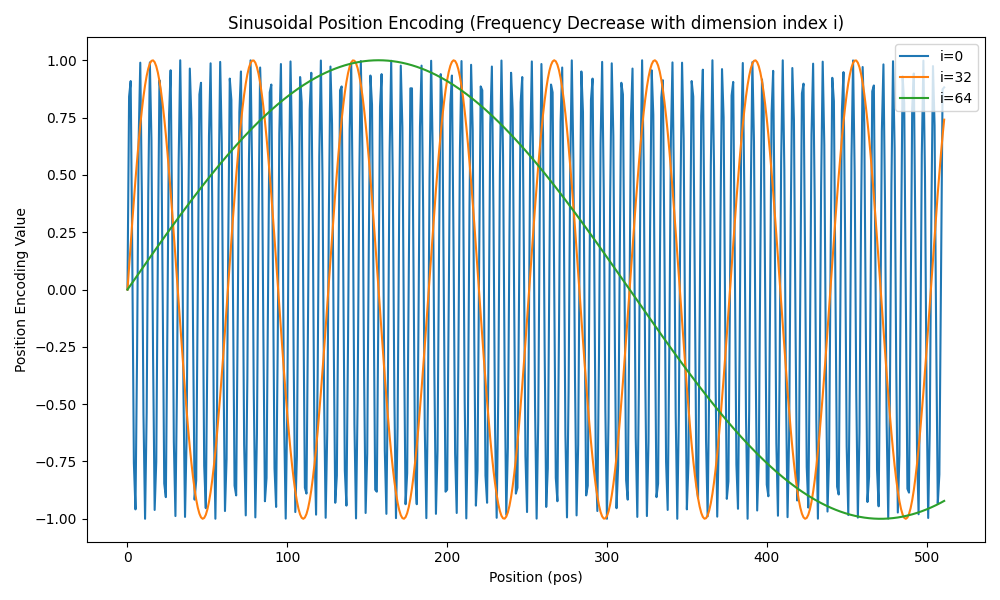

# 一、Sinusoidal PE是什么？
在Transformer原始论文《Attention is All You Need》中，作者使用了固定的**正余弦位置编码**Sinusoidal PE来为模型引入位置信息。其核心思想是利用不同频率的正弦波和余弦波对每个位置进行编码，具体公式如下：
$$
\text{PE}_{(pos, 2i)} = \sin\left(\frac{pos}{10000^{2i/d_{\text{model}}}}\right) \\
\text{PE}_{(pos, 2i+1)} = \cos\left(\frac{pos}{10000^{2i/d_{\text{model}}}}\right)
$$

其中，`pos`表示 token 在序列中的位置，取值范围为[0, 1, 2, ..., seq_len-1]；`i`表示embedding的维度索引，范围为$[0, 1, ..., d_{model}/2 - 1]$，`i`的所有取值总共有$d_{model}/2$个，每一个都分别通过施加sin或cos变换来对应某个token的embedding不同位置的偶数维与奇数维。

为了便于理解，这里来举个实际的例子来演示正余弦位置编码的工作原理。

假设$d_{model}$=8，token序列长度seq_len=120，现在需要计算序列中第2个位置（即`pos`=2）的token对应的位置编码，套公式：

计算每个维度的缩放因子：
| i | 维度 (2i / 2i+1) | $\text{div\_term}_i = 10000^{2i/d_{\text{model}}}$ |
|---|------------------|------------------------------------|
| 0 | 0 / 1            | $10000^{0} = 1$                    |
| 1 | 2 / 3            | $10000^{0.25} \approx 10$          |
| 2 | 4 / 5            | $10000^{0.5} = 100$                |
| 3 | 6 / 7            | $10000^{0.75} \approx 1000$        |

带入公式计算 PE：

$$
\begin{aligned}
\text{PE}(2, 0) &= \sin(2/1) = \sin(2.0) \approx 0.9093 \\
\text{PE}(2, 1) &= \cos(2/1) = \cos(2.0) \approx -0.4161 \\
\text{PE}(2, 2) &= \sin(2/10) = \sin(0.2) \approx 0.1987 \\
\text{PE}(2, 3) &= \cos(2/10) = \cos(0.2) \approx 0.9801 \\
\text{PE}(2, 4) &= \sin(2/100) = \sin(0.02) \approx 0.0200 \\
\text{PE}(2, 5) &= \cos(2/100) = \cos(0.02) \approx 0.9998 \\
\text{PE}(2, 6) &= \sin(2/1000) = \sin(0.002) \approx 0.0020 \\
\text{PE}(2, 7) &= \cos(2/1000) = \cos(0.002) \approx 0.9999 \\
\end{aligned}
$$

---

最终位置编码向量（pos = 2）为：

[0.9093, -0.4161, 0.1987, 0.9801, 0.0200, 0.9998, 0.0020, 0.9999]

正余弦位置编码的代码实现如下：

```python
def sinusoidal_position_encoding(seq_len, d_model):
    """
    计算正余弦位置编码（Sinusoidal PE）。

    参数：
    seq_len -- 序列长度
    d_model -- 模型的维度

    返回：
    返回一个形状为 (seq_len, d_model) 的位置编码矩阵
    """
    # 创建位置编码矩阵
    position = np.arange(seq_len)[:, np.newaxis]  # shape为 (seq_len, 1)
    div_term = np.power(10000, (2 * (np.arange(d_model // 2)) / np.float32(d_model)))  # 频率缩放因子

    # 计算正余弦位置编码
    pe = np.zeros((seq_len, d_model))
    pe[:, 0::2] = np.sin(position / div_term)  # 偶数维度用正弦
    pe[:, 1::2] = np.cos(position / div_term)  # 奇数维度用余弦

    return pe

# 示例：计算 seq_len=120，d_model=8 的位置编码
seq_len = 120
d_model = 8
pe = sinusoidal_position_encoding(seq_len, d_model)
print(pe)
print(pe.shape)# (120, 8)
```

# 二、Sinusoidal PE的远程衰减特性

正余弦位置编码不需要学习参数，节省了计算资源和存储空间。两者的组合能够平滑过渡，适合建模序列中的位置关系，并捕捉token之间的相对位置差异。

正余弦位置编码具有远程衰减的特性：对于一个序列中每个token的向量，在对每个token施加PE时，从序列token视角来看，每个token向量的低维元素(i较小)在相邻token之间的变化比较快，而高维(i较大)则比较慢。

举个例子，假设$d_{\text{model}} = 512$，$i = 256$，所以分母为$\frac{1}{10000^1} = 10^{-4}$。考虑两个位置：pos = 1000 和 pos = 1001，计算两者编码差值：
   
$$
\Delta = \sin(10^{-4} \cdot 1001) - \sin(10^{-4} \cdot 1000)
$$

也就是：
$$
\Delta = \sin(0.1001) - \sin(0.1000) \approx 0.0998337 - 0.0998334 = 0.0000003
$$

结果差值极小。

为了进一步验证这一点，这里绘制在不同的固定i取值下，pos的变化趋势：
```python
import numpy as np
import matplotlib.pyplot as plt

def sinusoidal_position_encoding(seq_len, d_model):
    """
    计算正余弦位置编码（Sinusoidal PE）。
    参数：
        seq_len -- 序列长度
        d_model -- 模型的维度
    返回：
        一个形状为 (seq_len, d_model) 的位置编码矩阵
    """
    position = np.arange(seq_len)[:, np.newaxis]  # (seq_len, 1)
    div_term = np.power(10000, (2 * (np.arange(d_model // 2)) / np.float32(d_model)))  # (d_model/2,)

    pe = np.zeros((seq_len, d_model))
    pe[:, 0::2] = np.sin(position / div_term)  # 偶数维度使用正弦
    pe[:, 1::2] = np.cos(position / div_term)  # 奇数维度使用余弦

    return pe

# 参数设置
seq_len = 512  # 序列长度
d_model = 128  # 模型的维度

# 获取位置编码
pe = sinusoidal_position_encoding(seq_len, d_model)

plt.figure(figsize=(10, 6))
fixed_pos = 10  # 固定位置
for i in [0,32,64]:  # 每6个维度展示一个
    plt.plot(np.arange(seq_len), pe[:, i], label=f'i={i}')
plt.xlabel("Position (pos)")
plt.ylabel("Position Encoding Value")
plt.title(f"Position Encoding at Fixed Position {fixed_pos} (Frequency Decrease with i)")
plt.legend(loc='upper right')
plt.tight_layout()
plt.show()
```


x轴是不同的pos，y轴是相应pos下最终位置编码的元素值。可以看到，当i=0（较小）时，随着pos的增大，相邻pos之间的差异变化幅度较大，而随着i变大，比如i=64时，相邻pos之间的差异非常小。

如上图所示，当i=64（较大）时，即使pos从10增到20，y轴对应的值变化也不大，这种细微的变化难以被模型感知。也就是说，当序列变长（seq_length较大），远距离(较大的i)相邻token对应元素之间的差异会变得不明显。

# 三、Sinusoidal PE的缺陷

正余弦位置编码的最大缺陷在于，它只能提供绝对位置信息。在推理中，Attention模块计算的是Q和K的点积，而PE是直接加到embedding上，这使得**模型要学习如何将绝对位置转换为相对位置信息**，增加了学习负担。

同时，虽然它在理论上可以无限延伸到任意长度的序列，但在训练时只见过短序列，对应的PE向量是低频为主。当推理时输入超长句子（如 GPT-2训练长度为1024，推理输入4096），位置编码对应的频率极高，数值变化剧烈，模型之前没有见过这些位置模式，导致性能下降。

为了应对这些问题，旋转位置编码(RoPE)被提出。

**一句话总结 RoPE 的本质贡献：**  
> **RoPE以绝对位置编码的方式实现了相对位置编码，从而提升了Transformer模型对长序列中相对位置变化的敏感性和结构建模能力。**

在下一篇文章中，我们将详细讲解RoPE的内容。