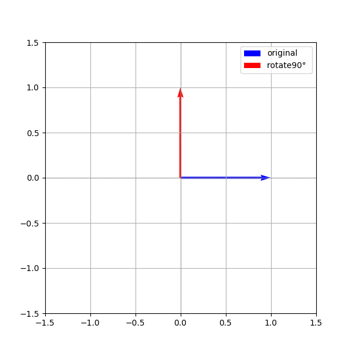

正余弦位置编码的最大问题，在于它将绝对位置信息编码成固定的向量，然后通过加法加入token embedding。这种方式虽然能提供位置信息，但在注意力计算（q·k）中很容易被抵消（位置编码是固定的，就像标签一样，注意力只关心内容相不相关，不关心你贴的标签。位置编码在点积里被 “淹没 + 抵消”，模型几乎感知不到位置信息），特别是高维度（较大的i）频率较低时，对短距离位置变化非常不敏感，导致模型在长序列任务中“分不清细节”。

为了解决这个问题，RoPE（Rotary Positional Embedding）通过一种旋转变换，**将位置信息直接融入到q和k的表示中**。

和正余弦编码一样，RoPE也没有引入需要学习的参数，但是RoPE将位置信息的引入方式从原来的“对于输入token的加法操作”变成了“对于q和k的旋转操作”，并且**以绝对位置编码的形式实现了相对位置编码**。

相对位置信息，即两个词向量(token embedding)之间的相对距离，假设在一个seq_length=100的序列中，两个词向量的位置pos分别为m和n，那它们之间的相对距离就是m-n，RoPE的目标就是在位置编码时引入m-n这一相对位置信息。

RoPE的目标，正是找到一种旋转操作，使得在不显式计算位置差m-n的情况下，位置编码自然地将“相对位置信息”融入到注意力机制中的$qk$中。换句话说，需要找到这么一种映射$g$，针对给定的两个用于计算注意力的向量$q$和$k$，以及m-n，使得
$$f(q,m)f(k,n)=g(q,k,m-n)$$

其中，$q$和$k$是长度为$d_{model}$的向量，m和n分别是对应向量中第m个和第n个pos处的元素。

# 一、回顾二维向量的旋转操作
根据线性代数的知识，二维向量的旋转操作，指的是对该二维向量施加一个旋转矩阵变换，变换前后只改变二维向量的方向而保持其模长不变。

给定一个二维向量：

$$
\mathbf{x} = \begin{bmatrix} x \\ y \end{bmatrix}
$$

我们希望将它在二维平面上**逆时针旋转**一个角度 $\theta$，可以通过乘以旋转矩阵来实现：

$$
\mathbf{x}_{\text{rot}} = R(\theta) \cdot \mathbf{x}
$$

其中旋转矩阵 $R(\theta)$ 为：

$$
R(\theta) = 
\begin{bmatrix}
\cos \theta & -\sin \theta \\
\sin \theta & \cos \theta
\end{bmatrix}
$$


举个实际例子，若 $$\mathbf{x} = \begin{bmatrix} 1 \\ 0 \end{bmatrix}$$ 且 $$\theta = \frac{\pi}{2}$$

（即逆时针旋转 90°）：

$$
\mathbf{x}_{\text{rot}} = 
\begin{bmatrix}
\cos \frac{\pi}{2} & -\sin \frac{\pi}{2} \\
\sin \frac{\pi}{2} & \cos \frac{\pi}{2}
\end{bmatrix}
\begin{bmatrix}
1 \\
0
\end{bmatrix}
=
\begin{bmatrix}
0 \\
1
\end{bmatrix}
$$


即：向量从 $$(1, 0)$$ 旋转为 $$(0, 1)$$

用代码可视化上述旋转过程，如下：

```python
import numpy as np
import matplotlib.pyplot as plt

def rotate_2d(x, y, theta_rad):
    R = np.array([
        [np.cos(theta_rad), -np.sin(theta_rad)],
        [np.sin(theta_rad),  np.cos(theta_rad)]
    ])
    vec = np.array([x, y])
    return R @ vec

# 原始向量
x0, y0 = 1, 0

# 旋转角度（单位：弧度）
theta_deg = 90
theta_rad = np.deg2rad(theta_deg)

# 旋转后向量
x1, y1 = rotate_2d(x0, y0, theta_rad)

# 可视化
plt.figure(figsize=(6, 6))
plt.quiver(0, 0, x0, y0, angles='xy', scale_units='xy', scale=1, color='blue', label='original')
plt.quiver(0, 0, x1, y1, angles='xy', scale_units='xy', scale=1, color='red', label=f'rotate{theta_deg}° ')

# 坐标轴设置
plt.xlim(-1.5, 1.5)
plt.ylim(-1.5, 1.5)
plt.gca().set_aspect('equal')
plt.axhline(0, color='gray', linestyle='--', linewidth=0.5)
plt.axvline(0, color='gray', linestyle='--', linewidth=0.5)
plt.grid(True)
plt.legend()

plt.show()
```



# 二、RoPE的工作原理（d_model=2）
前面说过，RoPE 是将位置信息通过旋转操作直接注入到注意力机制中的 $q$ 和 $k$ 向量中。

假设：

- 模型维度：$d_{\text{model}} = 2$
- 原始向量：
  $$
  \mathbf{q} = \begin{bmatrix} 1 \\ 2 \end{bmatrix}, \quad \mathbf{k} = \begin{bmatrix} 3 \\ 4 \end{bmatrix}
  $$
- 序列位置：设为 $\text{pos}_q = m$，$\text{pos}_k = n$
- 对应位置角频率为 $\theta = \omega \cdot \text{pos}$，其中 $\omega$ 是一个频率超参数

---

### Step 1: 对 q 和 k 分别旋转

定义二维旋转操作为：

$$
\text{RoPE}(\mathbf{x}, \theta) = 
\begin{bmatrix}
\cos \theta & -\sin \theta \\
\sin \theta & \cos \theta
\end{bmatrix}
\cdot \mathbf{x}
$$

分别对 $\mathbf{q}$ 和 $\mathbf{k}$ 施加旋转：

- 设 $\theta_q = \omega \cdot m,\quad \theta_k = \omega \cdot n$
- 旋转后的向量为：

$$
\tilde{\mathbf{q}} = R(\theta_q)\cdot \mathbf{q}, \quad 
\tilde{\mathbf{k}} = R(\theta_k)\cdot \mathbf{k}
$$

---

### Step 2: 点积操作变成了**相对位置信息的函数**

旋转后计算注意力时，执行的是：

$$
\tilde{\mathbf{q}}^\top \cdot \tilde{\mathbf{k}} = \mathbf{q}^\top R(-\theta_q) R(\theta_k) \cdot \mathbf{k}
= \mathbf{q}^\top R(\theta_k - \theta_q) \cdot \mathbf{k}
$$

即：

> **RoPE 实现了 “绝对位置编码方式得到的相对位置感知”**：注意力变成了与 $(n - m)$（即位置差）相关的点积结果。

---

### 示例（假设 $\omega = 1$, $m = 1$, $n = 2$）

- 则 $\theta_q = 1$, $\theta_k = 2$
- $R(\theta_k - \theta_q) = R(1)$

那么有：

```python
import numpy as np

q = np.array([1, 2])
k = np.array([3, 4])

# 相对旋转角
theta = 1.0  # θ_k - θ_q
R = np.array([
    [np.cos(theta), -np.sin(theta)],
    [np.sin(theta),  np.cos(theta)],
])

k_rot = R @ k
att_score = q @ k_rot
print("注意力得分（RoPE）:", att_score)# 7.62626733416533，是一个数，代表了q向量中的第m个元素和k向量中的第n个元素的注意力得分。
```

事实上，RoPE将每对特征维度（比如 [x₀, x₁]）看作是二维平面上的一个点(x₀, x₁)，然后将其绕原点(0, 0)顺时针或逆时针旋转一个角度θ（由位置pos决定），这个操作的数学本质就是二维向量绕原点旋转。

这个旋转中心正是(0, 0)。所以可以想象：特征 [x0, x1] 像一个在平面上的箭头，RoPE 让它随着token的位置pos增大不断绕原点旋转，旋转角度=pos × freq_i。


# 三、推广到高维向量(词向量,d_model维,d_model >> 2)
上面介绍了当向量为二维时，RoPE的工作原理。

当向量维度非常高时，比如词向量的维度，可以**把高维向量中不同位置(i)的元素两两分成一组，分别执行旋转操作**，如下：

$$
\boldsymbol{R}_{\Theta,m}^{d_{model}} \boldsymbol{x} =
\begin{pmatrix}
\cos m\theta_0 & -\sin m\theta_0 & 0 & 0 & \cdots & 0 & 0 \\
\sin m\theta_0 & \cos m\theta_0 & 0 & 0 & \cdots & 0 & 0 \\
0 & 0 & \cos m\theta_2 & -\sin m\theta_2 & \cdots & 0 & 0 \\
0 & 0 & \sin m\theta_2 & \cos m\theta_2 & \cdots & 0 & 0 \\
\vdots & \vdots & \vdots & \vdots & \ddots & \vdots & \vdots \\
0 & 0 & 0 & 0 & \cdots & \cos m\theta_{d_{model}-2} & -\sin m\theta_{d_{model}-2} \\
0 & 0 & 0 & 0 & \cdots & \sin m\theta_{d_{model}-2} & \cos m\theta_{d_{model}-2}
\end{pmatrix}
\begin{pmatrix} 
x_0 \\
x_1 \\
x_2 \\
\vdots \\
x_{d_{model}-2} \\
x_{d_{model}-1}
\end{pmatrix}
$$


其中，$\Theta=\left\{\theta_i=\omega^{-\frac{i}{d_{model}}}, i \in [0, 2, \ldots, d_{model}-2] \right\}$。

注意，公式中的m指的是pos，即序列中第m个词向量的pos=m，之所以不用pos，是为了使得公式看起来简洁。

这个高维旋转矩阵是高度稀疏的，在代码实现时，通常改写成如下方式进行替代，以减少冗余计算：

$$
\boldsymbol{R}_{\Theta,m}^{d_{model}} \boldsymbol{x} = 
\begin{pmatrix}
x_{0} \\
x_{1} \\
x_{2} \\
x_{3} \\
\vdots \\
x_{d_{model}-2} \\
x_{d_{model}-1}
\end{pmatrix} 
\otimes 
\begin{pmatrix} 
\cos m\theta_0 \\
\cos m\theta_0 \\
\cos m\theta_2 \\
\cos m\theta_2 \\
\vdots \\
\cos m\theta_{d_{model}-2} \\
\cos m\theta_{d_{model}-2}
\end{pmatrix}
+ 
\begin{pmatrix}
-x_{1} \\
x_{0} \\
-x_{3} \\
x_{2} \\
\vdots \\
-x_{d_{model}-1} \\
x_{d_{model}-2}
\end{pmatrix} 
\otimes 
\begin{pmatrix} 
\sin m\theta_0 \\
\sin m\theta_0 \\
\sin m\theta_2 \\
\sin m\theta_2 \\
\vdots \\
\sin m\theta_{d_{model}-2} \\
\sin m\theta_{d_{model}-2}
\end{pmatrix}
$$

可以看到，经过RoPE，词向量的维度不变（仍为$d_{model}$）。

# 四、代码实现RoPE

```python
import torch

def precompute_freqs_cis(d_model: int, end: int = int(32 * 1024), omiga: float = 1e6):
    freqs = 1.0 / (omiga ** (torch.arange(0, d_model, 2)[: (d_model // 2)].float() / d_model))
    t = torch.arange(end, device=freqs.device)# end是最长预计算freqs的长度，可任意扩增
    freqs = torch.outer(t, freqs).float()# 外积×：[end x 1, 1 x d_model//2)-->end x d_model//2 , 得到 "每个位置 × 每个频率" 的角度 θ
    freqs_cos = torch.cat([torch.cos(freqs), torch.cos(freqs)], dim=-1)# end x d_model//2--> end x d_model
    freqs_sin = torch.cat([torch.sin(freqs), torch.sin(freqs)], dim=-1)# end x d_model//2--> end x d_model
    return freqs_cos, freqs_sin

def apply_rotary_pos_emb(q, k, cos, sin, position_ids=None, unsqueeze_dim=1):
    def rotate_half(x):
        return torch.cat((-x[..., x.shape[-1] // 2:], x[..., : x.shape[-1] // 2]), dim=-1)

    q_embed = (q * cos.unsqueeze(unsqueeze_dim)) + (rotate_half(q) * sin.unsqueeze(unsqueeze_dim))
    k_embed = (k * cos.unsqueeze(unsqueeze_dim)) + (rotate_half(k) * sin.unsqueeze(unsqueeze_dim))
    return q_embed, k_embed

d_model=4
q=torch.tensor([1,2,3,4])
k=torch.tensor([5,6,7,8])

freqs_cos, freqs_sin = precompute_freqs_cis(d_model)
q_embed, k_embed=apply_rotary_pos_emb(q,k,freqs_cos, freqs_sin)
print(q_embed.shape, k_embed.shape)# torch.Size([32768, 1, 4]) torch.Size([32768, 1, 4])   1是维度扩展得到的，4是d_model，32768是当前设置的最长序列长度
```